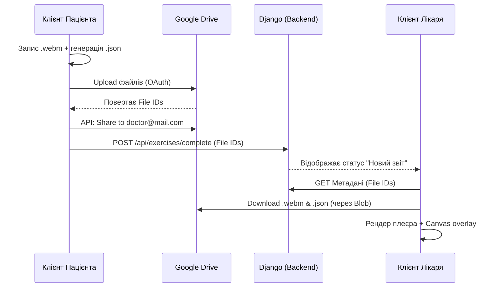

# Data Flow: BYOS (Bring Your Own Storage)

**Статус:** Draft
**Пов'язані файли:** [[2_Connection_WebRTC]], [[3_MediaPipe_Integration]]

## Концепція
Система використовує архітектуру BYOS. KROK.cv не зберігає медичні відео пацієнтів на власних серверах (Django), знімаючи з себе юридичну відповідальність (GDPR/HIPAA) та витрати на AWS/S3. Дані зберігаються на Google Drive пацієнта і шаряться лікарю.

## Життєвий цикл даних (Solo Mode)

1. **Генерація:** Локально на клієнті (React/Electron) створюються два файли:
   - `video_record.webm` (чистий відеопотік 480p/720p).
   - `telemetry.json` (масив зашифрованих координат MediaPipe + таймстемпи).
2. **Завантаження (Upload):** - Клієнт авторизується через Google Workspace OAuth.
   - Файли пушаться у приховану папку `AppData` на Google Drive пацієнта.
3. **Маршрутизація:**
   - Клієнт через Google Drive API видає права на читання (`reader`) для email-адреси лікуючого лікаря.
   - На Django-сервер відправляється лише легкий мета-запит (ID файлів, ID вправи, статус "Виконано").
4. **Споживання (Download):**
   - Лікар відкриває дашборд. React-клієнт лікаря стягує `webm` та `json` напряму з Google Drive в оперативну пам'ять (Blob) і рендерить у плеєрі.

