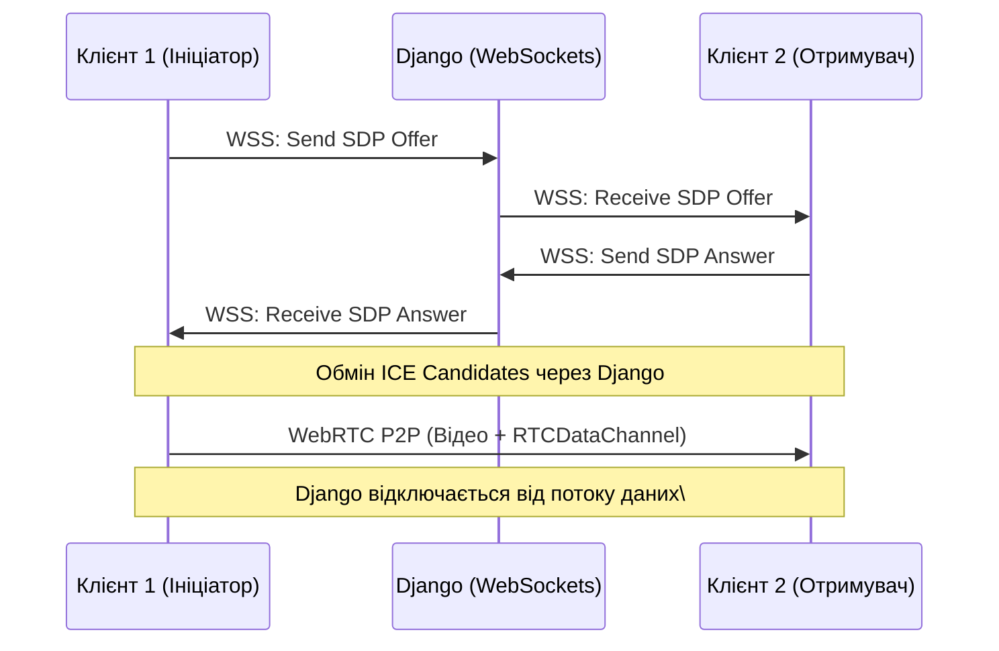

# Connection: WebRTC & Signaling

**Статус:** Draft
**Пов'язані файли:** [[1_Data_Flow_BYOS]]

## Концепція
Для синхронних сесій (Live) використовується WebRTC з наскрізним шифруванням (E2EE - DTLS/SRTP). Django-сервер виконує виключно роль Signaling-сервера і не пропускає через себе відеопотік.

## Протокол з'єднання

1. **Signaling (Django Channels/WebSockets):** Використовується для обміну `SDP Offer` та `SDP Answer` між пірами.
2. **Пробиття NAT:** Використовуються публічні STUN-сервери Google (`stun.l.google.com:19302`) для генерації ICE Candidates.
3. **Канали зв'язку (PeerConnection):**
   - `MediaStreamTrack`: Трансляція відео та аудіо.
   - `RTCDataChannel`: Текстовий канал низької затримки для передачі координат `telemetry.json` у реальному часі (якщо лікар увімкнув відображення скелета).

 