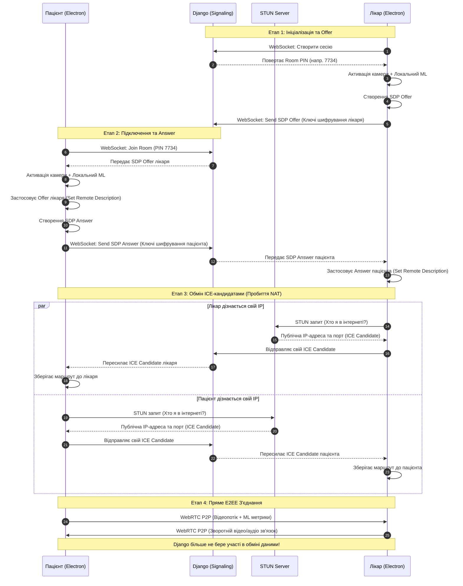

```mermaid
sequenceDiagram
    autonumber
    participant P as Пацієнт (Electron)
    participant D as Django (Signaling)
    participant S as STUN Server
    participant L as Лікар (Electron)

    Note over L, D: Етап 1: Ініціалізація та Offer
    L->>D: WebSocket: Створити сесію
    D-->>L: Повертає Room PIN (напр. 7734)
    L->>L: Активація камери + Локальний ML
    L->>L: Створення SDP Offer
    L->>D: WebSocket: Send SDP Offer (Ключі шифрування лікаря)

    Note over P, D: Етап 2: Підключення та Answer
    P->>D: WebSocket: Join Room (PIN 7734)
    D-->>P: Передає SDP Offer лікаря
    P->>P: Активація камери + Локальний ML
    P->>P: Застосовує Offer лікаря (Set Remote Description)
    P->>P: Створення SDP Answer
    P->>D: WebSocket: Send SDP Answer (Ключі шифрування пацієнта)
    D-->>L: Передає SDP Answer пацієнта
    L->>L: Застосовує Answer пацієнта (Set Remote Description)

    Note over P, L: Етап 3: Обмін ICE-кандидатами (Пробиття NAT)
    par Лікар дізнається свій IP
        L->>S: STUN запит (Хто я в інтернеті?)
        S-->>L: Публічна IP-адреса та порт (ICE Candidate)
        L->>D: Відправляє свій ICE Candidate
        D-->>P: Пересилає ICE Candidate лікаря
        P->>P: Зберігає маршрут до лікаря
    and Пацієнт дізнається свій IP
        P->>S: STUN запит (Хто я в інтернеті?)
        S-->>P: Публічна IP-адреса та порт (ICE Candidate)
        P->>D: Відправляє свій ICE Candidate
        D-->>L: Пересилає ICE Candidate пацієнта
        L->>L: Зберігає маршрут до пацієнта
    end

    Note over P, L: Етап 4: Пряме E2EE З'єднання
    P->>L: WebRTC P2P (Відеопотік + ML метрики)
    L->>P: WebRTC P2P (Зворотній відео/аудіо зв'язок)
    Note over P, L: Django більше не бере участі в обміні даними!
```

